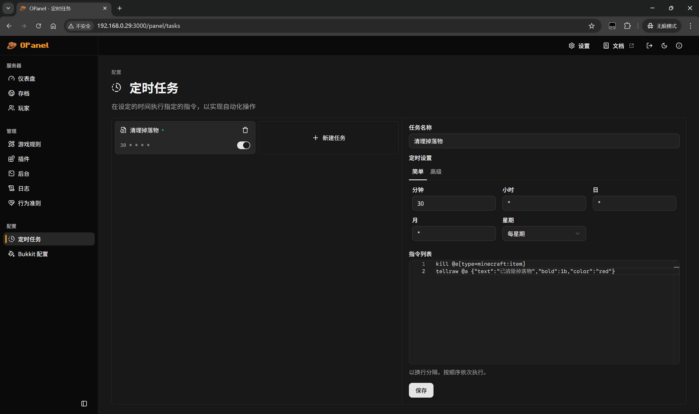
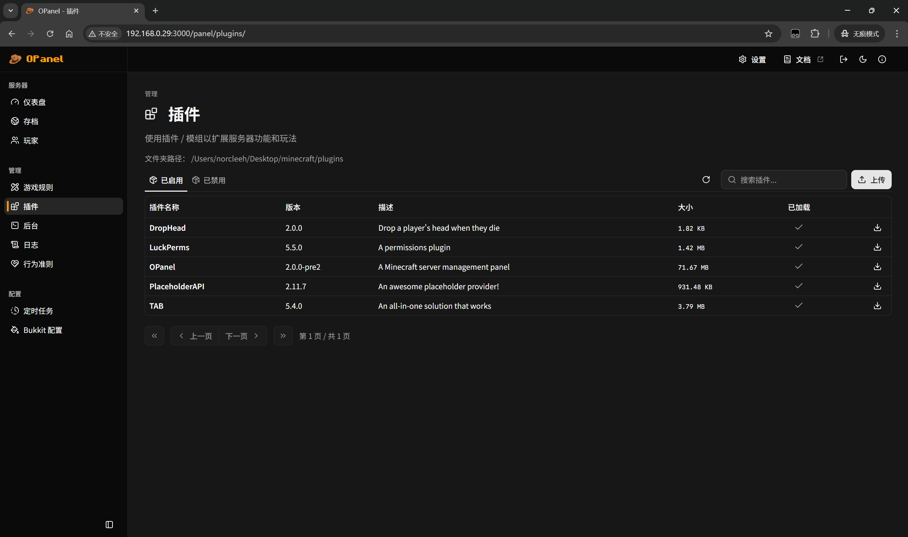

 
 

> Minecraft 服务器管理面板

[English](README.md) | 中文

## 简介

OPanel 是一个为 Minecraft 服务器管理员制作的管理面板，它以服务端插件的形式运行，支持 Bukkit、Spigot、Paper、Fabric、Forge 和 NeoForge 服务器。通过网页端面板，您可以以更可靠、直观和简便的方式管理您的服务器！

### 功能特性

OPanel 的功能包括：

- 仪表盘：提供服务器的全面概览
- 存档管理：帮助您通过简单的界面轻松上传、下载、删除或启用世界存档
- 玩家管理：帮助您管理玩家、封禁玩家和白名单，并执行踢出、封禁或更改权限等操作
- 游戏规则编辑器：帮助您无需输入任何命令即可编辑游戏规则
- 插件管理器：帮助您启用 / 禁用插件或模组，或查看插件的详细信息
- 终端控制台：可以直接从 Web 面板发送消息或执行命令
- 服务器日志管理器和查看器

### 预览

## 用法

请阅读[快速开始](https://opanel.cn/docs/quick-start.html)。

## 贡献

查看[贡献指南](https://opanel.cn/docs/contributing.html)以了解更多信息。

## 友情链接

## Star 历史曲线

## License

[MPL-2.0](./LICENSE)
