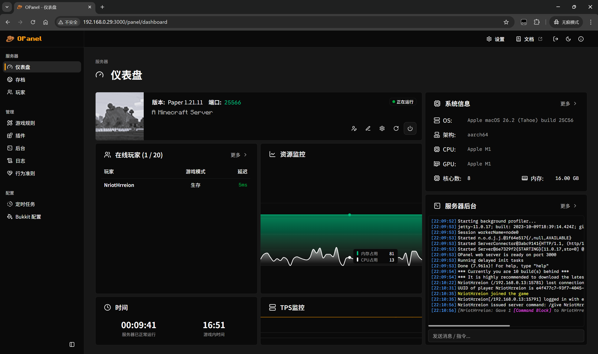
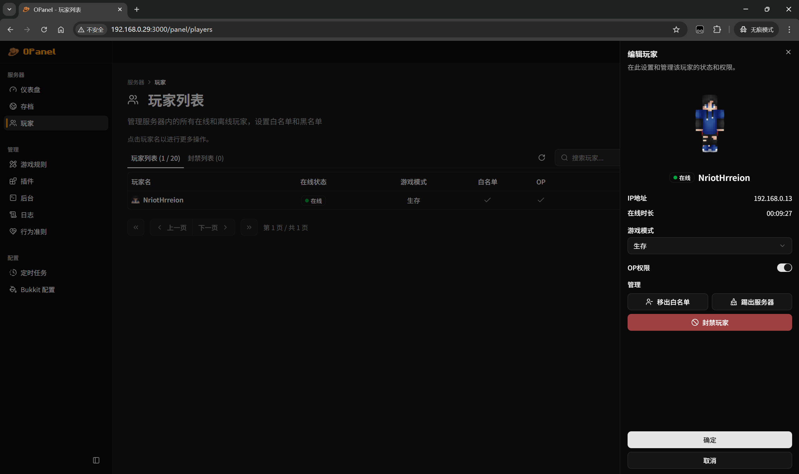
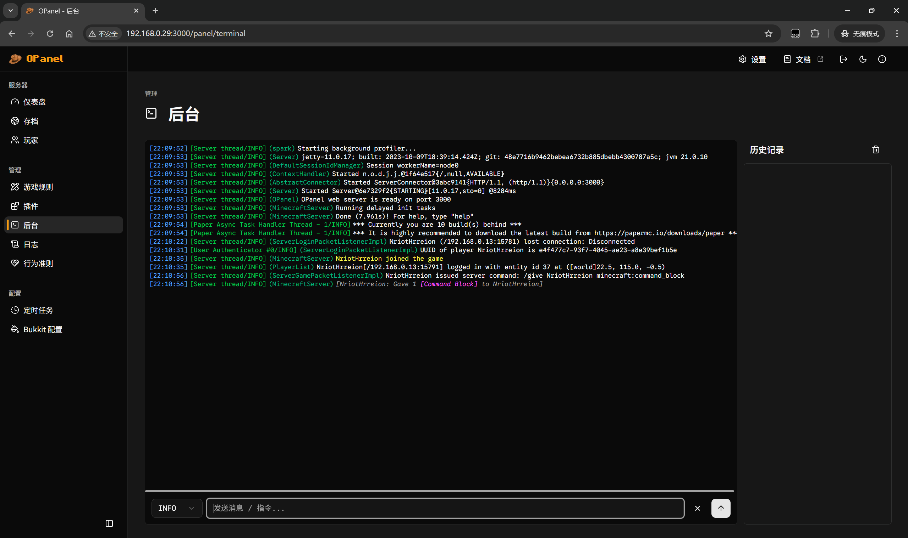

 
 

> A Minecraft server management panel

English | [中文](README-zh.md)

## Description

OPanel is a management panel for Minecraft server administrators, and it comes as a server-side plugin that can be run on Bukkit, Spigot, Paper, Fabric, Forge and NeoForge servers. With the web panel, you can manage your server in a more reliable, intuitive and simple way!

### Features

The features of OPanel include:

- Dashboard that provides a comprehensive overview of the server
- Saves manager that helps you easily upload, download, delete or enable your saves through a simple interface.
- Players manager that helps you manage players, banned players and whitelist, and perform actions like kick, ban or changing permissions.
- Gamerules editor that assists you to toggle gamerules without entering any command.
- Plugins manager. (In plan)
- Server terminal that can directly send messages or execute commands from the web panel.
- Server logs manager and viewer.

### Screenshots

## Usage

Read the [Quick Start](https://opanel.cn/docs/quick-start.html) to get started.

## Contributing

See [Contributing Guidelines](https://opanel.cn/docs/contributing.html) for more information.

## Friend Links

## License

[MPL-2.0](./LICENSE)
